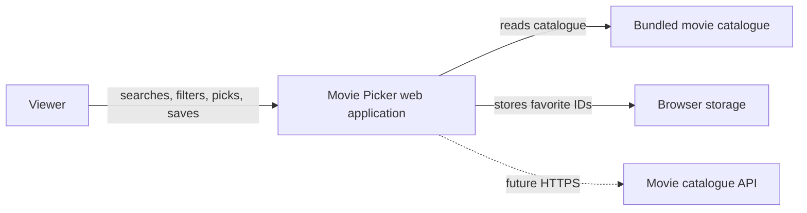
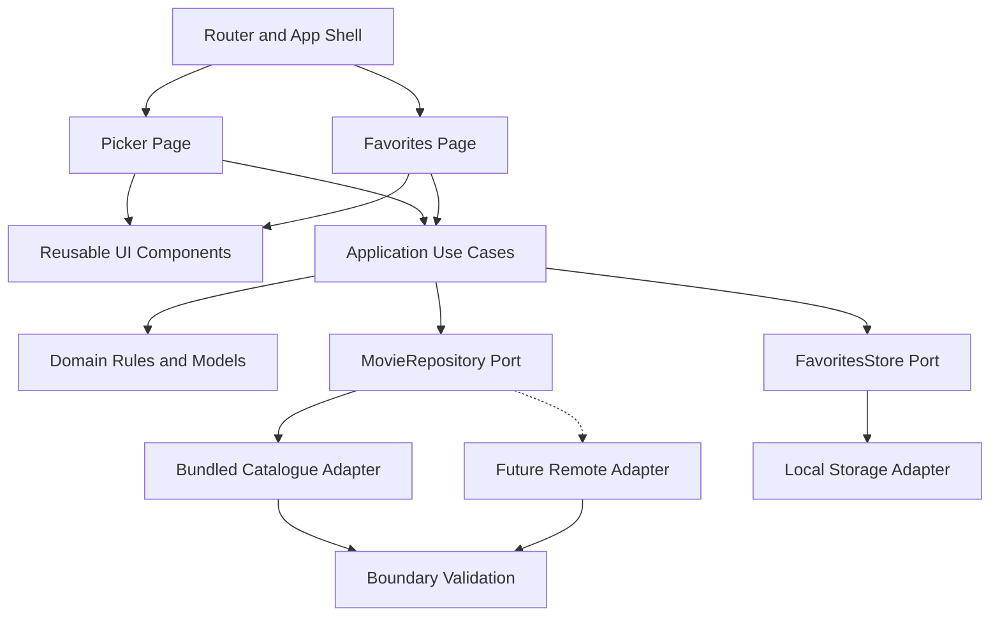
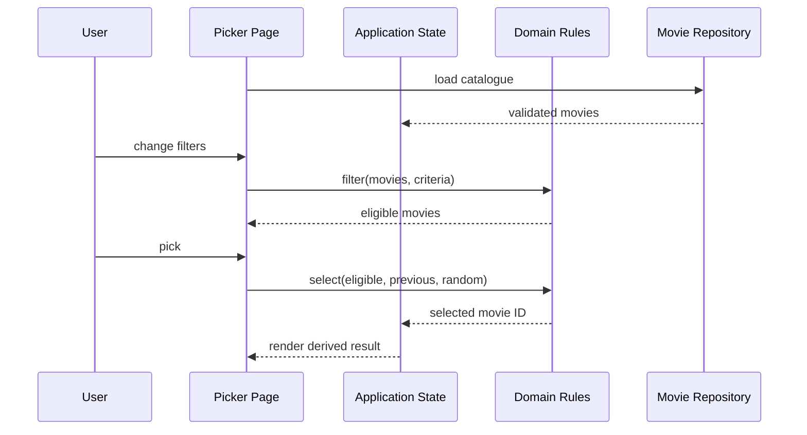

# Movie Picker Software Architecture

Document status: Approved architecture baseline  
Related specifications: [REQUIREMENTS.md](./REQUIREMENTS.md), [DESIGN.md](./DESIGN.md)  
Last updated: 2026-08-18

## 1. Executive summary

Movie Picker is a client-side React application inside an Nx workspace. It separates domain decisions from React rendering, catalogue access, and browser persistence. The first release uses a bundled catalogue and local favorite storage. Repository and storage interfaces leave room for a remote catalogue or account-backed favorites without changing domain rules or pages.

Architecture IDs connect technical decisions with implementation tasks, tests, and future evolution.

## 2. Technology baseline

| Concern | Technology | Role |
| --- | --- | --- |
| Workspace | Nx 23 | Project discovery, targets, caching, affected execution |
| UI | React 19 | Components and rendering |
| Language | TypeScript 6 | Static types and domain contracts |
| Routing | React Router 6 | Client-side routes |
| Development/build | Vite 8 | Dev server and production bundle |
| Unit/component tests | Vitest 4, Testing Library | Domain and UI verification |
| Browser tests | Playwright | Cross-browser journeys |
| Styling | CSS/CSS modules | Tokens, responsive layout, component styles |
| Persistence | Web Storage adapter | Favorite IDs for the first release |

- **ARCH-TECH-001 · Essential:** Workspace operations use inferred Nx targets for serve, build, lint, typecheck, test, preview, and e2e.
- **ARCH-TECH-002 · Important:** A new runtime dependency appears only when the browser, React, or an existing package does not reasonably provide the capability.
- **ARCH-TECH-003 · Important:** Each runtime dependency has a documented purpose and clear ownership.

## 3. System context



The browser hosts the first-release application. There is no custom server, authentication system, payment service, or personal profile store.

## 4. Component view



Dependencies move from pages toward application and domain code. Adapters depend on domain contracts, while domain code remains independent of frameworks and infrastructure.

## 5. Source organization

```text
movie-picker/src/
  app/                 composition, router, and error boundary
  pages/               picker, favorites, and not-found routes
  components/          reusable presentational UI
  features/picker/     picker orchestration and UI
  features/favorites/  favorites orchestration and UI
  application/         use cases and infrastructure ports
  domain/              Movie model and pure business rules
  data/                catalogue, validation, repository adapters
  storage/             favorite persistence adapters
  styles/              shared tokens and global styles
```

Equivalent names are acceptable when ownership and dependency direction remain clear.

- **ARCH-BOUND-001 · Essential:** Domain modules contain types and pure business rules without React, router, DOM, storage, or network imports.
- **ARCH-BOUND-002 · Essential:** Pages and features receive validated domain values rather than raw catalogue payloads.
- **ARCH-BOUND-003 · Important:** Reusable UI components receive data and callbacks and do not access persistence or catalogue infrastructure directly.
- **ARCH-BOUND-004 · Important:** Code shared by one feature stays with that feature. Cross-feature code earns a shared location through demonstrated reuse.
- **ARCH-BOUND-005 · Essential:** Feature, application, domain, and adapter modules form an acyclic dependency graph.

## 6. Domain model

```ts
type MovieId = string;

interface Movie {
  id: MovieId;
  title: string;
  releaseYear: number;
  genres: readonly string[];
  synopsis: string;
  posterUrl: string | null;
}

interface MovieFilter {
  titleQuery: string;
  genre: string | null;
}
```

- **ARCH-DOM-001 · Essential:** `Movie.id` is the identity source across selection, rendering, routes, and favorites.
- **ARCH-DOM-002 · Essential:** Domain collections expose readonly values to prevent accidental cross-layer mutation.
- **ARCH-DOM-003 · Essential:** Filtering is a pure function of movies and filter criteria.
- **ARCH-DOM-004 · Essential:** Selection is a pure function when supplied with eligible movies, the previous ID, and a random-number source.
- **ARCH-DOM-005 · Important:** Domain errors use explicit results or classified error types rather than UI text.

## 7. Application ports

```ts
interface MovieRepository {
  getAll(signal?: AbortSignal): Promise<readonly Movie[]>;
}

interface FavoritesStore {
  load(): Promise<readonly MovieId[]>;
  save(ids: readonly MovieId[]): Promise<void>;
}
```

- **ARCH-PORT-001 · Essential:** Pages depend on application operations or hooks, not concrete repository and storage adapters.
- **ARCH-PORT-002 · Important:** Repository operations accept cancellation when an implementation performs network work.
- **ARCH-PORT-003 · Essential:** Storage contains unique IDs rather than copied movie objects.
- **ARCH-PORT-004 · Important:** Adapter replacement leaves page and domain APIs unchanged.

## 8. Data validation

Bundled catalogue data and future remote responses follow the same boundary process:

1. Parse unknown input.
2. Validate required fields and reasonable ranges.
3. Normalize whitespace, genres, and nullable poster references.
4. Detect duplicate IDs.
5. Return readonly movies or a classified load failure.

- **ARCH-DATA-001 · Essential:** Unknown external data is validated before entering application state.
- **ARCH-DATA-002 · Essential:** Invalid records never reach rendering as partially trusted `Movie` values.
- **ARCH-DATA-003 · Important:** Validation retains useful development diagnostics while user-facing errors remain safe.
- **ARCH-DATA-004 · Essential:** UI modules do not parse raw JSON or remote payloads.
- **ARCH-DATA-005 · Important:** Genre normalization produces one stable label for equivalent source values.

## 9. State ownership and flow



Canonical state contains catalogue load state, search text, selected genre, selected movie ID, and favorite IDs. Eligible movies, selected details, genre options, and favorite flags are derived values.

- **ARCH-STATE-001 · Essential:** Each canonical value has one owner.
- **ARCH-STATE-002 · Essential:** Derived collections and flags come from canonical state instead of synchronized effects.
- **ARCH-STATE-003 · Important:** State transitions use immutable updates.
- **ARCH-STATE-004 · Essential:** Side effects occur in event handlers, effects, or application services, never during render.
- **ARCH-STATE-005 · Important:** Effects list complete dependencies and clean up subscriptions, timers, and abortable work.

## 10. Favorite persistence

The first-release record uses a namespaced, versioned structure:

```json
{
  "version": 1,
  "movieIds": ["movie-123", "movie-456"]
}
```

- **ARCH-STORE-001 · Essential:** Storage access is isolated in the favorites adapter.
- **ARCH-STORE-002 · Essential:** Missing storage, denied access, malformed JSON, unsupported versions, and invalid IDs resolve to a safe empty state.
- **ARCH-STORE-003 · Essential:** IDs are deduplicated before state and persistence updates.
- **ARCH-STORE-004 · Important:** A schema version enables future migration without guessing the record shape.
- **ARCH-STORE-005 · Important:** Storage failures preserve in-memory usability and surface a non-sensitive status when relevant.

## 11. Routing and rendering

- **ARCH-ROUTE-001 · Essential:** One `BrowserRouter` wraps the application at its entry point.
- **ARCH-ROUTE-002 · Essential:** Route configuration covers `/`, `/favorites`, and a wildcard not-found route.
- **ARCH-ROUTE-003 · Important:** Internal navigation uses router links or navigation APIs.
- **ARCH-ROUTE-004 · Essential:** An application error boundary preserves a recovery path after an unexpected render failure.
- **ARCH-ROUTE-005 · Important:** Route components orchestrate features and avoid accumulating reusable business rules.

## 12. Error model

Expected categories include `catalogue-unavailable`, `catalogue-invalid`, `storage-unavailable`, and `unexpected`.

- **ARCH-ERR-001 · Essential:** Repository and storage failures become explicit application error categories.
- **ARCH-ERR-002 · Essential:** User messages omit stack traces, credentials, private endpoints, request headers, and raw payloads.
- **ARCH-ERR-003 · Important:** Recoverable errors retain safe state and offer retry, reset, or navigation to a working route.
- **ARCH-ERR-004 · Important:** Development diagnostics preserve the original error through a cause or controlled logging boundary.

## 13. Security and privacy

- **ARCH-SEC-001 · Essential:** Secrets and private API keys stay outside repository files and browser bundles.
- **ARCH-SEC-002 · Essential:** Untrusted HTML never reaches `dangerouslySetInnerHTML`.
- **ARCH-SEC-003 · Essential:** External poster locations use HTTPS and browser image rendering rather than HTML injection.
- **ARCH-SEC-004 · Important:** Persistence stores movie IDs only and avoids personal data.
- **ARCH-SEC-005 · Important:** Future network access applies timeout, cancellation, status handling, and response validation.
- **ARCH-SEC-006 · Important:** Dependency changes include lockfile integrity checks and avoid packages that duplicate platform functionality.

## 14. Performance strategy

Filtering remains linear with catalogue size. Genre options and normalized title text can be memoized after measurement shows a useful gain. Poster dimensions prevent layout shifts, and below-fold images use lazy loading. Feature code splitting becomes appropriate when bundle measurement justifies the complexity.

- **ARCH-PERF-001 · Important:** Performance optimizations follow measured evidence rather than speculative complexity.
- **ARCH-PERF-002 · Important:** Memoized values use complete dependencies and retain behavior equivalent to direct calculation.
- **ARCH-PERF-003 · Important:** Production builds contain no generated welcome component or unused sample feature.

## 15. Testing architecture

### Domain tests

Vitest covers case-insensitive filtering, whitespace normalization, combined criteria, empty sets, index boundaries, immediate-repeat avoidance, and immutable behavior.

### Adapter tests

Vitest covers valid and invalid catalogue records, duplicate IDs, storage absence, malformed JSON, version mismatch, ID deduplication, and write failure.

### Component tests

Testing Library covers visible states, accessible names, keyboard interaction, favorite synchronization, and error recovery through public UI behavior.

### End-to-end tests

Playwright covers release acceptance, unknown routes, storage restoration, no-match filters, poster fallback, and responsive navigation in Chromium, Firefox, and WebKit.

- **ARCH-TEST-001 · Essential:** Pure domain rules run without React rendering or browser infrastructure.
- **ARCH-TEST-002 · Essential:** Adapter edge cases use controlled fixtures rather than a live third-party service.
- **ARCH-TEST-003 · Important:** Component tests observe public behavior rather than internal state.
- **ARCH-TEST-004 · Essential:** The product acceptance scenario has Playwright coverage.
- **ARCH-TEST-005 · Important:** Tests remain deterministic through injected randomness, fixed data, and isolated browser storage.

## 16. Build and delivery

Nx provides the supported execution path:

```powershell
npm exec nx lint @org/movie-picker
npm exec nx typecheck @org/movie-picker
npm exec nx test @org/movie-picker
npm exec nx build @org/movie-picker
npm exec nx e2e @org/movie-picker-e2e
```

- **ARCH-CI-001 · Essential:** Release candidates pass applicable lint, typecheck, test, build, and e2e targets.
- **ARCH-CI-002 · Important:** CI uses Nx affected execution where appropriate while retaining full verification for release branches.
- **ARCH-CI-003 · Important:** Build artifacts originate from the Vite production target and remain outside source control.
- **ARCH-CI-004 · Essential:** A failed essential verification target blocks release readiness.

## 17. Evolution path

### Remote catalogue

A remote adapter can implement `MovieRepository`, validate responses, handle cancellation and timeouts, and leave pages and domain rules unchanged.

### Account-backed favorites

An authenticated adapter can replace browser persistence after product scope introduces accounts. Conflict resolution and migration receive a separate decision record.

### Shared Nx libraries

Feature extraction into an Nx library becomes useful after a second application consumes the capability or independent ownership provides a clear benefit.

## 18. Recorded decisions

| Decision | Choice | Reason |
| --- | --- | --- |
| ADR-001 | Client-side MVP | Current scope requires no custom backend |
| ADR-002 | Bundled catalogue behind a repository port | Predictable release with a clean remote-data path |
| ADR-003 | Favorite IDs in versioned browser storage | Minimal persistence without duplicated movie records |
| ADR-004 | Pure domain functions with injected randomness | Deterministic tests and framework-independent rules |
| ADR-005 | Composed React state before a global state library | Current state size does not justify another dependency |
| ADR-006 | Nx inferred targets as execution contract | Consistency with workspace tooling and caching |

## 19. Architecture maintenance

Significant technical decisions are recorded as ADR entries with their context, selected option, alternatives, and consequences. The architecture evolves when product needs or measured constraints justify a change. Diagrams, boundaries, data contracts, and operational guidance stay synchronized with the implemented system.
